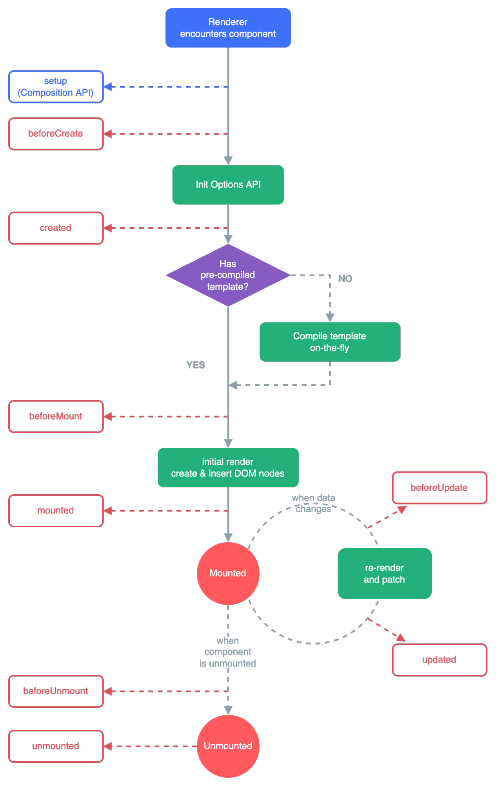

# Formation Vue 3

## API d'options VS API composition

Composition = nouveauté de vue 3
- une clé setup dans laquelle on met tous les éléments de notre composant
- On integre setup directement dans la balise script et Vue fera le travail seul sans qu'on ai besoin d'exporter un objet
- Meilleures compréhension, lecture, performances

## Directives

- **v-text** : permet de passer une variable en tant que texte à une balise html (équivaux à {{machin}}) - peu utilisé car doit être seul dans la balise cible
- **v-html** : permet de passer un contenu html avec une balise (ne fonctionnera pas avec la synthaxe au dessus car converti en string)
- **v-bind** : permet de passer une variable à un attribut HTML (classe, id, ect) - ex : `v-bind:class="variable"`
- - Cette directive est si utilisée qu'elle a une forme simpliée : `:class="variable"`
- - On peut lui passer une fonction qui retourne une valeur aussi

### Gestion d'évènements

- **v-on** : ex: `v-on:click="myfunction`
- - Comme le v-bind, cette directive étant très utilisée elle a une forme abbrégée : `@click="myfunction`

On peut ajouter des **modifiers** (par ex pour empècher la propagation aux parents ou un rafraichissement au submit).  
Quelques exemples utiles :  
- **Stop** : `@click.stop="myfunction"` 
- **Prevent** : `@submit.prevent="myfunction"`
- **Escape** : `@keyup.escape="myfunction"`
- **Enter** : `@keyup.enter="myfunction"`

## Réactivité

- **Proxy** : Pour rendre le DOM réactif, Vue utilise **Proxy**, un élément JS. Cette propriété permet de créer une copie de l'élément original et de lui ajouter un getter et un setter. C'est la base de la réactivité
- **Fonction reactive()** : On met les propriétés dans un objet dans la fonction reactive (qu'on peut appeler state). En utilisant la fonctionnalité proxy, cette fonction les rendra réactives. Cependant, cela ne fonctionne que pour les objet et pas pour les variables de type primitive.
- **Fonction ref()** : Comme reactive mais fonctionne aussi pour primitives. En revanche il faut toujours manipuler la clé "value".
- **Fonction computed()** :  L'avantage par rapport aux méthode précédente est que dans le cas où il y a plusieurs variables qui peuvent changer, lorsqu'une change, Vue ne va pas tout recalculer dans le DOM. En effet ici Vue stockera en cache les valeurs et en cas de changement ne recalculera que ce qui a beosin de l'être. => +++ performance. 
- - Impossible de faire du asynchrone et ne doit pas impacter d'autres élément que celui qu'il modifie directement (pas d'effets de bord)
- **v-model** : Permet le lier un input à la valeur d'une variable (dans les 2 sens !)
- **Fonction watch()** : Répond au manque du computed : effets secondaires et async. Surveille une variable puis execute le code à chaque changement de cette variable. Utile pour créer des effets secondaires, par ex : on augmente un quantité et on watch les modifications sur cette quantité, et à chaque modif on incrémente un compteur du nb de changements ayant eu lieu.
- **Fonction watchEffect()** : Le watchEffect est similaire au watch, cependant, le watch ne se joue que si un changement a lieu alors que le watchEffect va s'invoquer une première fois directement puis quand il y a des changements.  

## Style

On utilise **scoped** dans la balise style d'un composant si on souhaite isoler le css de la balise du reste de l'application.  
Si on ne met rien le style sera global.  

## Les directives structurelles

Ce sont les directives qui vont avoir un effet sur ce qui s'affiche ou non dans le DOM

- **v-if** / **v-else** / **v-else-if** : affiche selon des conditions
- **v-show** : si faux ajoute un display none plutot que de l'enlever du DOM - peut être interessant pour quelque chose qui change souvent car moins gourmand que le v-if ou pour garder la ref à un élement du DOM
- **v-pre** : permet de dire à Vue de ne pas interpréter le code de la balise - par pour afficher du code sur le front
- **v-for** : `v-for="x in y"`
- - index : `v-for="(x, index)  in y"`
- - key : permet d'afficher la clé de la valeur dans le cas d'une iteration sur un objet `v-for="(x, key, index)  in y"`
- - On peut itérer sur un int aussi, auquel cas ça fera une boucle de int elements
- - On peut préciser une clé :key sur chaque itération pour qu'en cas de changement, le nombre d'opération faite par vue soit réduit. D'autant plus important pour une grande liste
- **v-once** : permet de binder un élément une seule fois - quand une autre valeur change, Vue n'écoutera plus cette valuer, ce qui peut être intéressant pour les énorme pages
- **v-memo** : `v-memo="[variable]"` ici Vue ne réevaluera les varible de la div que si la varible de v-memo ne change.
 
## Les composants

### Composants locaux et globaux

=> Dans les composants `import Component from ./...` = appel local   
=> Dans main.ts `app.component('Component', Component)` = global - disponible partout ensuite  

On utilise principalement les imports locaux - en global on perd la fonctionnalité tree checking (compile uniquement ce qui est utile)

### Les props

On peut passer des infos du parent à l'enfant en utilisant  
- Sur le parent : `Component :name="machin"` - On utilise le : (binding) car sinon tout ce qu'on passe sera interprété comme une string  
- Sur l'enfant : `const props = defineProps({machin: {type: String, required: true, defaut: "chise"}})` - On ne doit pas modifier la prop sur l'enfant sinon Vue perdu 
**Verifications**
- Pour chaque propriété on peut ajouter un validator = une fonction dans la déclaration de la prop de defineProps qui check ce qu'on reçoit.
- Pour valider via typescript, on met `defineProps<{prix?: number, name: string}>(blabla)`. Le ? spécifie que la prop n'est pas required (par défaut). On peut aussi définir une interface qu'on peut mettre dans un dossier "Interface" et on le passe dans le defineProps. On ne peut pas mettre de validator ou de valeur par défaut dans cette méthode.

### Les events

Parfois, on souhaite passer une info d'un enfant à un parent 
- **Emit** On peut utiliser un emit sur un event : `@click="$emit('bigger')"` - avec par exemple sur le parent un `@bigger="fontSize++"`
- En général, on met les emits à part dans un defineEmits() (comme defineProps) - Ce qui permet d'ajouter aussi un validator et des arguments. 
- Un événement custom, contrairement aux évenements natifs ne se propage qu'au parent direct.

### Cycle de vie

### Fonctionnalités avancées des composants

- **v-model** peut s'utiliser sur un composant directement : `<Component v-model="content />` cela équivaut à un binding `<Component :modelValue="content @update:modelValue="content = $event" />`. Dans l'enfant, il suffit ensuite de lier le contenu à la prop puis de lui faire emettre un event updtae:modelValue quand il change, ce qui demandera au parent de mettre à jour la valuer - en effet, l'enfant ne doit pas modifier la prop qu'il reçoit. 
- - modelValue est la valeur par défaut, on peut la personnaliser et donc aussi mettre plusieurs v-models sur notre composant : `v-model:machin="content"`
- - On peut de plus lier un modifier à notre v-model : `v-model:machin.modifier="content"`

- **Cascade** : si je définis une class ou un event listener sur mon parent `<Composant class="container" />`, la classe sera directement appliquée à mon élément enfant tant qu'il est seul. S'il y en a plusieurs, alors Vue ne saura pas sur lequel appliquer et ne l'appliquera nul part.
- - Pour répondre à cela, on peut utiliser sur l'élément qu'on veut `<h1 :class="$attrs.class">`
- - Une autre manière de le récupérer est d'utilise useAttrs : `const attrs = useAttrs()` - ce qui permet de l'utilise ensuite où on veut (sans le $ du coup).
- - On peut aussi utiliser v-bind : `v-bind="attrs"` et tous les attribus seront mis sur l'élément.

- **Slots** : est ce qu'on pourrait passer carrément du HTML à notre élément enfant ? 
- - On met un `<slot></slot>` dans l'enfant, et ça va récupérer le contenu html renseigné dans le parent

- **Provide/Inject** : On a vu que pour échanger de l'information entre un parent et un enfant, on peut utiliser les props dans un sens puis les events pour la remonter dans l'autre sens. Cependant : comment faire si entre mon parent et mon enfant j'ai une multitude d'enfants qui eux n'ont pas besoin de cette information ?
- - On utilise provide dans le parent pour mettre à disposition de tous les enfants la data
- - Puis inject pour récupérer dans l'enfant cette data.

- On peut importer no composants qui n'ont pas besoin d'être visible dès le début via **defineAsyncComponent** 

## Lexique

- **SPA** : Single page application 
- **SFC** : Single file component
- **Directives** : v-if, v-bind, ect... = options que vue reconnait
- **Tick** : action de rafraichissement du DOM par Vue
